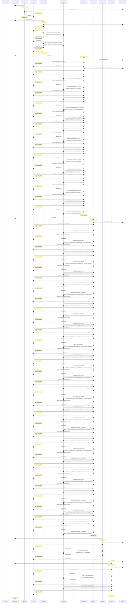

# Trace Report

**Task:** # Prompt — LangChain OCR Pipeline (Mistral Vision)  ## Objectif Créer un pipeline Python modulaire utilisant LangChain pour transcrire des documents complexes (tableaux, formulaires, mise en page multi-colonnes) via l'API Mistral Vision et stocker le résultat dans ChromaDB.  ## Stack imposée (ne pas dévier) - **OCR / Vision** : `mistral-ocr-latest` via API Mistral (`mistralai` SDK) - **Embeddings** : `sentence-transformers/all-MiniLM-L6-v2` via `langchain-community` `HuggingFaceEmbeddings` - **Vector store** : ChromaDB via `langchain-community` `Chroma` (mode HTTP client) - **Orchestration** : LangChain uniquement - **Python** : 3.10  ## Fichiers à produire — liste exhaustive  Un seul fichier par responsabilité. Pas de doublon, pas de sous-dossier.  ``` src/ ├── load_images.py          → load_images_from_directory(dir: str) -> list[str] ├── transcribe.py           → transcribe_image(image_path: str, client: Mistral) -> str ├── clean_text.py           → clean_text(text: str) -> str ├── generate_embeddings.py  → generate_embeddings(results: list[tuple[str,str]]) -> list[Document] ├── store_data.py           → store_documents(docs: list[Document], host: str, port: int) -> None └── pipeline.py             → run_pipeline(input_dir, chroma_host, chroma_port) — point d'entrée requirements.txt            → à la racine uniquement docker-compose.yml          → ChromaDB uniquement .env.example query_example.py            → exemple de recherche dans Chroma ```  ## Contrats d'interface stricts  ### `transcribe.py` - Utiliser le modèle `mistral-ocr-latest` via `mistralai` SDK - Encoder l'image en base64 et l'envoyer comme `image_url` avec le prefix `data:image/jpeg;base64,` - Prompt système : `"Extract all text from this document. Preserve the structure: titles, paragraphs, tables, lists. Return plain text only."` - Retourner le contenu texte de la première `choice.message.content` - Raise `FileNotFoundError` si le fichier n'existe pas - Raise `MistralAPIException` si l'appel échoue (ne pas silencer)  Exemple d'appel : ```python import base64 from mistralai import Mistral  def transcribe_image(image_path: str, client: Mistral) -> str:     with open(image_path, "rb") as f:         image_data = base64.b64encode(f.read()).decode("utf-8")      response = client.chat.complete(         model="mistral-ocr-latest",         messages=[{             "role": "user",             "content": [                 {"type": "text", "text": "Extract all text from this document. Preserve the structure: titles, paragraphs, tables, lists. Return plain text only."},                 {"type": "image_url", "image_url": {"url": f"data:image/jpeg;base64,{image_data}"}}             ]         }]     )     return response.choices[0].message.content.strip() ```  ### `pipeline.py` - Instancier `Mistral(api_key=os.getenv("MISTRAL_API_KEY"))` une seule fois - Passer le client à `transcribe_image` — ne pas le réinstancier dans la boucle - Logger chaque image traitée avec succès et chaque erreur - Continuer le pipeline si une image échoue (ne pas arrêter)  ### `generate_embeddings.py` - Instancier `HuggingFaceEmbeddings` **une seule fois** avant la boucle - Retourne `list[Document]` avec `page_content=text` et `metadata={"source": image_path}`  ### `store_data.py` - Utilise `chromadb.HttpClient(host=host, port=port)` - Utilise `Chroma(client=chroma_client, collection_name="ocr_documents", embedding_function=embeddings)` - **Ne pas appeler** `vector_store.persist()` — deprecated depuis ChromaDB 0.4 - Raise si la connexion ChromaDB échoue  ### `clean_text.py` - Normaliser les espaces (`re.sub(r'\s+', ' ', text)`) - Supprimer les lignes vides répétées - **Ne pas remplacer** les chiffres par des lettres  ### `docker-compose.yml` - Service `chromadb` uniquement, image `chromadb/chroma:latest` - Port exposé : `8001:8000` - Variable `CHROMA_SERVER_HTTP_PORT=8000` - Pas de `build:`, pas de Dockerfile custom  ### `requirements.txt` ``` mistralai>=1.0.0 langchain-community>=0.2.0 langchain-core>=0.2.0 chromadb>=0.5.0 sentence-transformers>=2.2.0 Pillow>=10.0.0 python-dotenv>=1.0.0 ``` - **Ne pas inclure** : `pytesseract`, `tensorflow`, `torch`, `transformers`, `tesseract-ocr`  ## `.env.example` ``` MISTRAL_API_KEY=your_mistral_api_key_here CHROMA_HOST=localhost CHROMA_PORT=8001 INPUT_DIR=./images ```  ## `query_example.py` Montrer comment : 1. Se connecter à Chroma en HTTP 2. Instancier les mêmes embeddings `all-MiniLM-L6-v2` 3. Faire une recherche par similarité avec une question textuelle 4. Afficher les résultats avec leur score et métadonnée `source`  ## Gestion d'erreurs - Image illisible ou format non supporté → logger et continuer - Clé API Mistral manquante → raise `ValueError` au démarrage de `run_pipeline` - ChromaDB inaccessible → raise avec message clair - Réponse Mistral vide → logger un warning et sauter l'image
**Run ID:** `a7efab50-9b38-4932-8f09-028adfe3e92a`
**Timestamp:** `2026-03-29T14:59:11Z`
**Generated:** 2026-03-29 15:05:58 UTC
**Git:** `d778d47a7023` · branch `main`
**Total events:** 232

## Token Usage

| Agent | Model | Calls | Prompt | Completion | Total |
|-------|-------|-------|--------|------------|-------|
| `planner` | `llama3.1-8b` | 1 | 0 | 0 | **3,854** |
| `architect` | `llama3.1-8b` | 3 | 0 | 0 | **11,350** |
| `dev` | `qwen-3-235b-a22b-instruct-2507` | 15 | 0 | 0 | **59,558** |
| `test` | `qwen-3-235b-a22b-instruct-2507` | 30 | 0 | 0 | **47,449** |
| `reviewer` | `llama3.1-8b` | 2 | 0 | 0 | **10,079** |
| `writeup` | `llama3.1-8b` | 3 | 0 | 0 | **7,623** |
| **TOTAL** | | | 0 | 0 | **139,913** |

## Memory Operations

| Agent | Operation | Layer | Summary |
|-------|-----------|-------|---------|
| `planner` | `inject` | `L3` | 5 docs injected |
| `architect` | `inject` | `L3` | 5 docs injected |
| `dev` | `inject` | `L3` | 5 docs injected |
| `dev` | `recall` | `L3+L4` | technical constraints for LangChain OCR pipeline |
| `test` | `inject` | `L3` | 5 docs injected |
| `reviewer` | `inject` | `L3` | 5 docs injected |
| `reviewer` | `recall` | `L3+L4` |  |
| `writeup` | `inject` | `L3` | 5 docs injected |

## File Attribution

| File | Agent | Model | Lines | Hash |
|------|-------|-------|-------|------|
| `src/pipeline.py` | `architect` | `llama3.1-8b` | 1–45 | `sha256:f4ca07c4f1a0bb92` |
| `src/pipeline.py` | `dev` | `qwen-3-235b-a22b-instruct-2507` | 1–45 | `sha256:f4ca07c4f1a0bb92` |
| `src/generate_embeddings.py` | `architect` | `llama3.1-8b` | 1–28 | `sha256:64f62f4592706073` |
| `src/generate_embeddings.py` | `dev` | `qwen-3-235b-a22b-instruct-2507` | 1–28 | `sha256:64f62f4592706073` |
| `src/load_images.py` | `dev` | `qwen-3-235b-a22b-instruct-2507` | 1–35 | `sha256:3a4105330e16ea81` |
| `src/transcribe.py` | `dev` | `qwen-3-235b-a22b-instruct-2507` | 1–21 | `sha256:405b9f53b4ac7d26` |
| `src/clean_text.py` | `dev` | `qwen-3-235b-a22b-instruct-2507` | 1–22 | `sha256:4e8786ecd764c496` |
| `src/store_data.py` | `dev` | `qwen-3-235b-a22b-instruct-2507` | 1–30 | `sha256:3491f71f523fbf45` |
| `README.md` | `writeup` | `llama3.1-8b` | 1–34 | `sha256:daccf72966e58fa1` |

## Sequence Diagram



## Event Log

| # | Time | Agent | Kind | Detail |
|---|------|-------|------|--------|
| 1 | `14:59:11` | `supervisor` | `supervisor_route` | → `planner` |
| 2 | `14:59:11` | `planner` | `agent_start` |  |
| 3 | `14:59:19` | `planner` | `memory_op` | `inject` [L3] 5 docs injected |
| 4 | `14:59:21` | `planner` | `llm_call` | model=`llama3.1-8b` iter=1 in=0 out=0 tot=3,854 |
| 5 | `14:59:21` | `planner` | `llm_response` | text only |
| 6 | `14:59:21` | `planner` | `agent_done` | 10,174ms |
| 7 | `14:59:21` | `supervisor` | `supervisor_route` | → `architect` |
| 8 | `14:59:21` | `architect` | `agent_start` |  |
| 9 | `14:59:21` | `architect` | `memory_op` | `inject` [L3] 5 docs injected |
| 10 | `14:59:23` | `architect` | `llm_call` | model=`llama3.1-8b` iter=1 in=0 out=0 tot=4,111 |
| 11 | `14:59:23` | `architect` | `llm_response` | +tools |
| 12 | `14:59:23` | `architect` | `tool_call` | `write_file` — path=src/pipeline.py  (1 lines) |
| 13 | `14:59:23` | `architect` | `tool_result` | `write_file` → Written 202 characters to src/pipeline.py |
| 14 | `14:59:26` | `architect` | `llm_call` | model=`llama3.1-8b` iter=2 in=0 out=0 tot=4,193 |
| 15 | `14:59:26` | `architect` | `llm_response` | +tools |
| 16 | `14:59:26` | `architect` | `tool_call` | `write_file` — path=src/generate_embeddings.py  (3 lines) |
| 17 | `14:59:26` | `architect` | `tool_result` | `write_file` → Written 144 characters to src/generate_embeddings.py |
| 18 | `14:59:29` | `architect` | `llm_call` | model=`llama3.1-8b` iter=3 in=0 out=0 tot=3,046 |
| 19 | `14:59:29` | `architect` | `llm_response` | text only |
| 20 | `14:59:29` | `architect` | `agent_done` | 7,923ms |
| 21 | `14:59:29` | `supervisor` | `supervisor_route` | → `dev` |
| 22 | `14:59:29` | `dev` | `agent_start` |  |
| 23 | `14:59:29` | `dev` | `memory_op` | `inject` [L3] 5 docs injected |
| 24 | `14:59:31` | `dev` | `llm_call` | model=`qwen-3-235b-a22b-instruct-2507` iter=1 in=0 out=0 tot=4,466 |
| 25 | `14:59:31` | `dev` | `llm_response` | +tools |
| 26 | `14:59:31` | `dev` | `memory_op` | `recall` [L3+L4] technical constraints for LangChain OCR pipeline |
| 27 | `14:59:34` | `dev` | `llm_call` | model=`qwen-3-235b-a22b-instruct-2507` iter=2 in=0 out=0 tot=4,882 |
| 28 | `14:59:34` | `dev` | `llm_response` | +tools |
| 29 | `14:59:34` | `dev` | `tool_call` | `write_file` — path=src/load_images.py  (27 lines) |
| 30 | `14:59:34` | `dev` | `tool_result` | `write_file` → Written 733 characters to src/load_images.py |
| 31 | `14:59:37` | `dev` | `llm_call` | model=`qwen-3-235b-a22b-instruct-2507` iter=3 in=0 out=0 tot=3,727 |
| 32 | `14:59:37` | `dev` | `llm_response` | +tools |
| 33 | `14:59:37` | `dev` | `tool_call` | `write_file` — path=src/transcribe.py  (17 lines) |
| 34 | `14:59:37` | `dev` | `tool_result` | `write_file` → Written 452 characters to src/transcribe.py |
| 35 | `14:59:40` | `dev` | `llm_call` | model=`qwen-3-235b-a22b-instruct-2507` iter=4 in=0 out=0 tot=3,697 |
| 36 | `14:59:40` | `dev` | `llm_response` | +tools |
| 37 | `14:59:40` | `dev` | `tool_call` | `write_file` — path=src/clean_text.py  (19 lines) |
| 38 | `14:59:40` | `dev` | `tool_result` | `write_file` → Written 455 characters to src/clean_text.py |
| 39 | `14:59:42` | `dev` | `llm_call` | model=`qwen-3-235b-a22b-instruct-2507` iter=5 in=0 out=0 tot=3,639 |
| 40 | `14:59:42` | `dev` | `llm_response` | +tools |
| 41 | `14:59:42` | `dev` | `tool_call` | `write_file` — path=src/generate_embeddings.py  (18 lines) |
| 42 | `14:59:42` | `dev` | `tool_result` | `write_file` → Written 527 characters to src/generate_embeddings.py |
| 43 | `15:00:53` | `dev` | `llm_call` | model=`qwen-3-235b-a22b-instruct-2507` iter=6 in=0 out=0 tot=3,749 |
| 44 | `15:00:53` | `dev` | `llm_response` | +tools |
| 45 | `15:00:53` | `dev` | `tool_call` | `write_file` — path=src/store_data.py  (28 lines) |
| 46 | `15:00:53` | `dev` | `tool_result` | `write_file` → Written 951 characters to src/store_data.py |
| 47 | `15:00:55` | `dev` | `llm_call` | model=`qwen-3-235b-a22b-instruct-2507` iter=7 in=0 out=0 tot=3,741 |
| 48 | `15:00:55` | `dev` | `llm_response` | +tools |
| 49 | `15:00:55` | `dev` | `tool_call` | `write_file` — path=src/transcribe.py  (19 lines) |
| 50 | `15:00:55` | `dev` | `tool_result` | `write_file` → Written 532 characters to src/transcribe.py |
| 51 | `15:00:58` | `dev` | `llm_call` | model=`qwen-3-235b-a22b-instruct-2507` iter=8 in=0 out=0 tot=4,009 |
| 52 | `15:00:58` | `dev` | `llm_response` | +tools |
| 53 | `15:00:58` | `dev` | `tool_call` | `write_file` — path=src/pipeline.py  (47 lines) |
| 54 | `15:00:58` | `dev` | `tool_result` | `write_file` → Written 1669 characters to src/pipeline.py |
| 55 | `15:01:01` | `dev` | `llm_call` | model=`qwen-3-235b-a22b-instruct-2507` iter=9 in=0 out=0 tot=3,961 |
| 56 | `15:01:01` | `dev` | `llm_response` | +tools |
| 57 | `15:01:01` | `dev` | `tool_call` | `write_file` — path=src/load_images.py  (26 lines) |
| 58 | `15:01:01` | `dev` | `tool_result` | `write_file` → Written 708 characters to src/load_images.py |
| 59 | `15:01:05` | `dev` | `llm_call` | model=`qwen-3-235b-a22b-instruct-2507` iter=10 in=0 out=0 tot=3,984 |
| 60 | `15:01:05` | `dev` | `llm_response` | +tools |
| 61 | `15:01:05` | `dev` | `tool_call` | `write_file` — path=src/transcribe.py  (22 lines) |
| 62 | `15:01:05` | `dev` | `tool_result` | `write_file` → Written 605 characters to src/transcribe.py |
| 63 | `15:02:15` | `dev` | `llm_call` | model=`qwen-3-235b-a22b-instruct-2507` iter=11 in=0 out=0 tot=3,744 |
| 64 | `15:02:15` | `dev` | `llm_response` | +tools |
| 65 | `15:02:15` | `dev` | `tool_call` | `write_file` — path=src/clean_text.py  (23 lines) |
| 66 | `15:02:15` | `dev` | `tool_result` | `write_file` → Written 582 characters to src/clean_text.py |
| 67 | `15:02:18` | `dev` | `llm_call` | model=`qwen-3-235b-a22b-instruct-2507` iter=12 in=0 out=0 tot=3,770 |
| 68 | `15:02:18` | `dev` | `llm_response` | +tools |
| 69 | `15:02:18` | `dev` | `tool_call` | `write_file` — path=src/generate_embeddings.py  (29 lines) |
| 70 | `15:02:18` | `dev` | `tool_result` | `write_file` → Written 806 characters to src/generate_embeddings.py |
| 71 | `15:02:21` | `dev` | `llm_call` | model=`qwen-3-235b-a22b-instruct-2507` iter=13 in=0 out=0 tot=3,888 |
| 72 | `15:02:21` | `dev` | `llm_response` | +tools |
| 73 | `15:02:21` | `dev` | `tool_call` | `write_file` — path=src/store_data.py  (31 lines) |
| 74 | `15:02:21` | `dev` | `tool_result` | `write_file` → Written 1057 characters to src/store_data.py |
| 75 | `15:02:24` | `dev` | `llm_call` | model=`qwen-3-235b-a22b-instruct-2507` iter=14 in=0 out=0 tot=4,134 |
| 76 | `15:02:24` | `dev` | `llm_response` | +tools |
| 77 | `15:02:24` | `dev` | `tool_call` | `write_file` — path=src/pipeline.py  (46 lines) |
| 78 | `15:02:24` | `dev` | `tool_result` | `write_file` → Written 1598 characters to src/pipeline.py |
| 79 | `15:02:27` | `dev` | `llm_call` | model=`qwen-3-235b-a22b-instruct-2507` iter=15 in=0 out=0 tot=4,167 |
| 80 | `15:02:27` | `dev` | `llm_response` | +tools |
| 81 | `15:02:27` | `dev` | `tool_call` | `write_file` — path=src/load_images.py  (36 lines) |
| 82 | `15:02:27` | `dev` | `tool_result` | `write_file` → Written 930 characters to src/load_images.py |
| 83 | `15:02:27` | `dev` | `agent_done` | 177,934ms |
| 84 | `15:02:27` | `supervisor` | `supervisor_route` | → `test` |
| 85 | `15:02:27` | `test` | `agent_start` |  |
| 86 | `15:02:27` | `test` | `memory_op` | `inject` [L3] 5 docs injected |
| 87 | `15:02:29` | `test` | `llm_call` | model=`qwen-3-235b-a22b-instruct-2507` iter=1 in=0 out=0 tot=1,925 |
| 88 | `15:02:29` | `test` | `llm_response` | +tools |
| 89 | `15:02:29` | `test` | `tool_call` | `read_file` — path=src/transcribe.py |
| 90 | `15:02:29` | `test` | `tool_result` | `read_file` → from typing import Any from langchain_community.document_loaders import UnstructuredFileLoader   class ImageTranscriber:… |
| 91 | `15:03:40` | `test` | `llm_call` | model=`qwen-3-235b-a22b-instruct-2507` iter=2 in=0 out=0 tot=1,624 |
| 92 | `15:03:40` | `test` | `llm_response` | +tools |
| 93 | `15:03:40` | `test` | `tool_call` | `read_file` — path=src/clean_text.py |
| 94 | `15:03:40` | `test` | `tool_result` | `read_file` → import re from typing import Any  class TextCleaner:     """     Cleans and normalizes extracted text.     """     def c… |
| 95 | `15:03:42` | `test` | `llm_call` | model=`qwen-3-235b-a22b-instruct-2507` iter=3 in=0 out=0 tot=1,502 |
| 96 | `15:03:42` | `test` | `llm_response` | +tools |
| 97 | `15:03:42` | `test` | `tool_call` | `read_file` — path=src/generate_embeddings.py |
| 98 | `15:03:42` | `test` | `tool_result` | `read_file` → from sentence_transformers import SentenceTransformer from typing import List   class EmbeddingGenerator:     """     Ge… |
| 99 | `15:03:45` | `test` | `llm_call` | model=`qwen-3-235b-a22b-instruct-2507` iter=4 in=0 out=0 tot=1,540 |
| 100 | `15:03:45` | `test` | `llm_response` | +tools |
| 101 | `15:03:45` | `test` | `tool_call` | `read_file` — path=src/load_images.py |
| 102 | `15:03:45` | `test` | `tool_result` | `read_file` → import os from typing import List   class ImageLoader:     """     Load image files from a directory.     """     def __… |
| 103 | `15:03:47` | `test` | `llm_call` | model=`qwen-3-235b-a22b-instruct-2507` iter=5 in=0 out=0 tot=1,596 |
| 104 | `15:03:47` | `test` | `llm_response` | +tools |
| 105 | `15:03:47` | `test` | `tool_call` | `read_file` — path=src/transcribe.py |
| 106 | `15:03:47` | `test` | `tool_result` | `read_file` → from typing import Any from langchain_community.document_loaders import UnstructuredFileLoader   class ImageTranscriber:… |
| 107 | `15:03:50` | `test` | `llm_call` | model=`qwen-3-235b-a22b-instruct-2507` iter=6 in=0 out=0 tot=1,558 |
| 108 | `15:03:50` | `test` | `llm_response` | +tools |
| 109 | `15:03:50` | `test` | `tool_call` | `read_file` — path=src/clean_text.py |
| 110 | `15:03:50` | `test` | `tool_result` | `read_file` → import re from typing import Any  class TextCleaner:     """     Cleans and normalizes extracted text.     """     def c… |
| 111 | `15:03:53` | `test` | `llm_call` | model=`qwen-3-235b-a22b-instruct-2507` iter=7 in=0 out=0 tot=1,502 |
| 112 | `15:03:53` | `test` | `llm_response` | +tools |
| 113 | `15:03:53` | `test` | `tool_call` | `read_file` — path=src/generate_embeddings.py |
| 114 | `15:03:53` | `test` | `tool_result` | `read_file` → from sentence_transformers import SentenceTransformer from typing import List   class EmbeddingGenerator:     """     Ge… |
| 115 | `15:03:55` | `test` | `llm_call` | model=`qwen-3-235b-a22b-instruct-2507` iter=8 in=0 out=0 tot=1,540 |
| 116 | `15:03:55` | `test` | `llm_response` | +tools |
| 117 | `15:03:55` | `test` | `tool_call` | `read_file` — path=src/load_images.py |
| 118 | `15:03:55` | `test` | `tool_result` | `read_file` → import os from typing import List   class ImageLoader:     """     Load image files from a directory.     """     def __… |
| 119 | `15:03:58` | `test` | `llm_call` | model=`qwen-3-235b-a22b-instruct-2507` iter=9 in=0 out=0 tot=1,596 |
| 120 | `15:03:58` | `test` | `llm_response` | +tools |
| 121 | `15:03:58` | `test` | `tool_call` | `read_file` — path=src/transcribe.py |
| 122 | `15:03:58` | `test` | `tool_result` | `read_file` → from typing import Any from langchain_community.document_loaders import UnstructuredFileLoader   class ImageTranscriber:… |
| 123 | `15:04:00` | `test` | `llm_call` | model=`qwen-3-235b-a22b-instruct-2507` iter=10 in=0 out=0 tot=1,558 |
| 124 | `15:04:00` | `test` | `llm_response` | +tools |
| 125 | `15:04:00` | `test` | `tool_call` | `read_file` — path=src/clean_text.py |
| 126 | `15:04:00` | `test` | `tool_result` | `read_file` → import re from typing import Any  class TextCleaner:     """     Cleans and normalizes extracted text.     """     def c… |
| 127 | `15:04:03` | `test` | `llm_call` | model=`qwen-3-235b-a22b-instruct-2507` iter=11 in=0 out=0 tot=1,501 |
| 128 | `15:04:03` | `test` | `llm_response` | +tools |
| 129 | `15:04:03` | `test` | `tool_call` | `read_file` — path=src/load_images.py |
| 130 | `15:04:03` | `test` | `tool_result` | `read_file` → import os from typing import List   class ImageLoader:     """     Load image files from a directory.     """     def __… |
| 131 | `15:04:06` | `test` | `llm_call` | model=`qwen-3-235b-a22b-instruct-2507` iter=12 in=0 out=0 tot=1,565 |
| 132 | `15:04:06` | `test` | `llm_response` | +tools |
| 133 | `15:04:06` | `test` | `tool_call` | `read_file` — path=src/pipeline.py |
| 134 | `15:04:06` | `test` | `tool_result` | `read_file` → from src.load_images import ImageLoader from src.transcribe import ImageTranscriber from src.clean_text import TextClean… |
| 135 | `15:04:08` | `test` | `llm_call` | model=`qwen-3-235b-a22b-instruct-2507` iter=13 in=0 out=0 tot=1,792 |
| 136 | `15:04:08` | `test` | `llm_response` | +tools |
| 137 | `15:04:08` | `test` | `tool_call` | `read_file` — path=src/transcribe.py |
| 138 | `15:04:08` | `test` | `tool_result` | `read_file` → from typing import Any from langchain_community.document_loaders import UnstructuredFileLoader   class ImageTranscriber:… |
| 139 | `15:04:11` | `test` | `llm_call` | model=`qwen-3-235b-a22b-instruct-2507` iter=14 in=0 out=0 tot=1,728 |
| 140 | `15:04:11` | `test` | `llm_response` | +tools |
| 141 | `15:04:11` | `test` | `tool_call` | `read_file` — path=src/load_images.py |
| 142 | `15:04:11` | `test` | `tool_result` | `read_file` → import os from typing import List   class ImageLoader:     """     Load image files from a directory.     """     def __… |
| 143 | `15:04:14` | `test` | `llm_call` | model=`qwen-3-235b-a22b-instruct-2507` iter=15 in=0 out=0 tot=1,558 |
| 144 | `15:04:14` | `test` | `llm_response` | +tools |
| 145 | `15:04:14` | `test` | `tool_call` | `read_file` — path=src/clean_text.py |
| 146 | `15:04:14` | `test` | `tool_result` | `read_file` → import re from typing import Any  class TextCleaner:     """     Cleans and normalizes extracted text.     """     def c… |
| 147 | `15:04:16` | `test` | `llm_call` | model=`qwen-3-235b-a22b-instruct-2507` iter=16 in=0 out=0 tot=1,566 |
| 148 | `15:04:16` | `test` | `llm_response` | +tools |
| 149 | `15:04:16` | `test` | `tool_call` | `read_file` — path=src/generate_embeddings.py |
| 150 | `15:04:16` | `test` | `tool_result` | `read_file` → from sentence_transformers import SentenceTransformer from typing import List   class EmbeddingGenerator:     """     Ge… |
| 151 | `15:04:19` | `test` | `llm_call` | model=`qwen-3-235b-a22b-instruct-2507` iter=17 in=0 out=0 tot=1,540 |
| 152 | `15:04:19` | `test` | `llm_response` | +tools |
| 153 | `15:04:19` | `test` | `tool_call` | `read_file` — path=src/load_images.py |
| 154 | `15:04:19` | `test` | `tool_result` | `read_file` → import os from typing import List   class ImageLoader:     """     Load image files from a directory.     """     def __… |
| 155 | `15:04:22` | `test` | `llm_call` | model=`qwen-3-235b-a22b-instruct-2507` iter=18 in=0 out=0 tot=1,596 |
| 156 | `15:04:22` | `test` | `llm_response` | +tools |
| 157 | `15:04:22` | `test` | `tool_call` | `read_file` — path=src/transcribe.py |
| 158 | `15:04:22` | `test` | `tool_result` | `read_file` → from typing import Any from langchain_community.document_loaders import UnstructuredFileLoader   class ImageTranscriber:… |
| 159 | `15:04:24` | `test` | `llm_call` | model=`qwen-3-235b-a22b-instruct-2507` iter=19 in=0 out=0 tot=1,558 |
| 160 | `15:04:24` | `test` | `llm_response` | +tools |
| 161 | `15:04:24` | `test` | `tool_call` | `read_file` — path=src/clean_text.py |
| 162 | `15:04:24` | `test` | `tool_result` | `read_file` → import re from typing import Any  class TextCleaner:     """     Cleans and normalizes extracted text.     """     def c… |
| 163 | `15:04:27` | `test` | `llm_call` | model=`qwen-3-235b-a22b-instruct-2507` iter=20 in=0 out=0 tot=1,502 |
| 164 | `15:04:27` | `test` | `llm_response` | +tools |
| 165 | `15:04:27` | `test` | `tool_call` | `read_file` — path=src/generate_embeddings.py |
| 166 | `15:04:27` | `test` | `tool_result` | `read_file` → from sentence_transformers import SentenceTransformer from typing import List   class EmbeddingGenerator:     """     Ge… |
| 167 | `15:04:30` | `test` | `llm_call` | model=`qwen-3-235b-a22b-instruct-2507` iter=21 in=0 out=0 tot=1,540 |
| 168 | `15:04:30` | `test` | `llm_response` | +tools |
| 169 | `15:04:30` | `test` | `tool_call` | `read_file` — path=src/load_images.py |
| 170 | `15:04:30` | `test` | `tool_result` | `read_file` → import os from typing import List   class ImageLoader:     """     Load image files from a directory.     """     def __… |
| 171 | `15:04:32` | `test` | `llm_call` | model=`qwen-3-235b-a22b-instruct-2507` iter=22 in=0 out=0 tot=1,597 |
| 172 | `15:04:32` | `test` | `llm_response` | +tools |
| 173 | `15:04:32` | `test` | `tool_call` | `read_file` — path=src/clean_text.py |
| 174 | `15:04:32` | `test` | `tool_result` | `read_file` → import re from typing import Any  class TextCleaner:     """     Cleans and normalizes extracted text.     """     def c… |
| 175 | `15:04:35` | `test` | `llm_call` | model=`qwen-3-235b-a22b-instruct-2507` iter=23 in=0 out=0 tot=1,566 |
| 176 | `15:04:35` | `test` | `llm_response` | +tools |
| 177 | `15:04:35` | `test` | `tool_call` | `read_file` — path=src/generate_embeddings.py |
| 178 | `15:04:35` | `test` | `tool_result` | `read_file` → from sentence_transformers import SentenceTransformer from typing import List   class EmbeddingGenerator:     """     Ge… |
| 179 | `15:04:38` | `test` | `llm_call` | model=`qwen-3-235b-a22b-instruct-2507` iter=24 in=0 out=0 tot=1,540 |
| 180 | `15:04:38` | `test` | `llm_response` | +tools |
| 181 | `15:04:38` | `test` | `tool_call` | `read_file` — path=src/load_images.py |
| 182 | `15:04:38` | `test` | `tool_result` | `read_file` → import os from typing import List   class ImageLoader:     """     Load image files from a directory.     """     def __… |
| 183 | `15:04:40` | `test` | `llm_call` | model=`qwen-3-235b-a22b-instruct-2507` iter=25 in=0 out=0 tot=1,596 |
| 184 | `15:04:40` | `test` | `llm_response` | +tools |
| 185 | `15:04:40` | `test` | `tool_call` | `read_file` — path=src/transcribe.py |
| 186 | `15:04:40` | `test` | `tool_result` | `read_file` → from typing import Any from langchain_community.document_loaders import UnstructuredFileLoader   class ImageTranscriber:… |
| 187 | `15:04:43` | `test` | `llm_call` | model=`qwen-3-235b-a22b-instruct-2507` iter=26 in=0 out=0 tot=1,558 |
| 188 | `15:04:43` | `test` | `llm_response` | +tools |
| 189 | `15:04:43` | `test` | `tool_call` | `read_file` — path=src/clean_text.py |
| 190 | `15:04:43` | `test` | `tool_result` | `read_file` → import re from typing import Any  class TextCleaner:     """     Cleans and normalizes extracted text.     """     def c… |
| 191 | `15:04:46` | `test` | `llm_call` | model=`qwen-3-235b-a22b-instruct-2507` iter=27 in=0 out=0 tot=1,502 |
| 192 | `15:04:46` | `test` | `llm_response` | +tools |
| 193 | `15:04:46` | `test` | `tool_call` | `read_file` — path=src/generate_embeddings.py |
| 194 | `15:04:46` | `test` | `tool_result` | `read_file` → from sentence_transformers import SentenceTransformer from typing import List   class EmbeddingGenerator:     """     Ge… |
| 195 | `15:04:48` | `test` | `llm_call` | model=`qwen-3-235b-a22b-instruct-2507` iter=28 in=0 out=0 tot=1,540 |
| 196 | `15:04:48` | `test` | `llm_response` | +tools |
| 197 | `15:04:48` | `test` | `tool_call` | `read_file` — path=src/load_images.py |
| 198 | `15:04:48` | `test` | `tool_result` | `read_file` → import os from typing import List   class ImageLoader:     """     Load image files from a directory.     """     def __… |
| 199 | `15:04:51` | `test` | `llm_call` | model=`qwen-3-235b-a22b-instruct-2507` iter=29 in=0 out=0 tot=1,597 |
| 200 | `15:04:51` | `test` | `llm_response` | +tools |
| 201 | `15:04:51` | `test` | `tool_call` | `read_file` — path=src/clean_text.py |
| 202 | `15:04:51` | `test` | `tool_result` | `read_file` → import re from typing import Any  class TextCleaner:     """     Cleans and normalizes extracted text.     """     def c… |
| 203 | `15:04:54` | `test` | `llm_call` | model=`qwen-3-235b-a22b-instruct-2507` iter=30 in=0 out=0 tot=1,566 |
| 204 | `15:04:54` | `test` | `llm_response` | +tools |
| 205 | `15:04:54` | `test` | `tool_call` | `read_file` — path=src/generate_embeddings.py |
| 206 | `15:04:54` | `test` | `tool_result` | `read_file` → from sentence_transformers import SentenceTransformer from typing import List   class EmbeddingGenerator:     """     Ge… |
| 207 | `15:04:54` | `test` | `agent_done` | 147,072ms |
| 208 | `15:04:54` | `supervisor` | `supervisor_route` | → `reviewer` |
| 209 | `15:04:54` | `reviewer` | `agent_start` |  |
| 210 | `15:04:54` | `reviewer` | `memory_op` | `inject` [L3] 5 docs injected |
| 211 | `15:04:57` | `reviewer` | `llm_call` | model=`llama3.1-8b` iter=1 in=0 out=0 tot=5,121 |
| 212 | `15:04:57` | `reviewer` | `llm_response` | +tools |
| 213 | `15:04:57` | `reviewer` | `tool_call` | `read_file` — path=requirements.txt |
| 214 | `15:04:57` | `reviewer` | `tool_result` | `read_file` → Error: file not found — requirements.txt |
| 215 | `15:04:59` | `reviewer` | `llm_call` | model=`llama3.1-8b` iter=2 in=0 out=0 tot=4,958 |
| 216 | `15:04:59` | `reviewer` | `llm_response` | +tools |
| 217 | `15:04:59` | `reviewer` | `memory_op` | `recall` [L3+L4]  |
| 218 | `15:05:04` | `supervisor` | `supervisor_route` | → `writeup` |
| 219 | `15:05:04` | `writeup` | `agent_start` |  |
| 220 | `15:05:04` | `writeup` | `memory_op` | `inject` [L3] 5 docs injected |
| 221 | `15:05:04` | `writeup` | `llm_call` | model=`llama3.1-8b` iter=1 in=0 out=0 tot=2,469 |
| 222 | `15:05:04` | `writeup` | `llm_response` | +tools |
| 223 | `15:05:04` | `writeup` | `tool_call` | `read_file` — path=requirements.txt |
| 224 | `15:05:04` | `writeup` | `tool_result` | `read_file` → Error: file not found — requirements.txt |
| 225 | `15:05:07` | `writeup` | `llm_call` | model=`llama3.1-8b` iter=2 in=0 out=0 tot=2,756 |
| 226 | `15:05:07` | `writeup` | `llm_response` | +tools |
| 227 | `15:05:07` | `writeup` | `tool_call` | `write_file` — path=README.md  (35 lines) |
| 228 | `15:05:07` | `writeup` | `tool_result` | `write_file` → Written 1013 characters to README.md |
| 229 | `15:05:53` | `writeup` | `llm_call` | model=`llama3.1-8b` iter=3 in=0 out=0 tot=2,398 |
| 230 | `15:05:53` | `writeup` | `llm_response` | text only |
| 231 | `15:05:53` | `writeup` | `agent_done` | 49,441ms |
| 232 | `15:05:53` | `supervisor` | `supervisor_route` | → `END` |

## TraceRecord JSON

```json
{
  "id": "a7efab50-9b38-4932-8f09-028adfe3e92a",
  "timestamp": "2026-03-29T14:59:11Z",
  "task": "# Prompt — LangChain OCR Pipeline (Mistral Vision)  ## Objectif Créer un pipeline Python modulaire utilisant LangChain pour transcrire des documents complexes (tableaux, formulaires, mise en page multi-colonnes) via l'API Mistral Vision et stocker le résultat dans ChromaDB.  ## Stack imposée (ne pas dévier) - **OCR / Vision** : `mistral-ocr-latest` via API Mistral (`mistralai` SDK) - **Embeddings** : `sentence-transformers/all-MiniLM-L6-v2` via `langchain-community` `HuggingFaceEmbeddings` - **Vector store** : ChromaDB via `langchain-community` `Chroma` (mode HTTP client) - **Orchestration** : LangChain uniquement - **Python** : 3.10  ## Fichiers à produire — liste exhaustive  Un seul fichier par responsabilité. Pas de doublon, pas de sous-dossier.  ``` src/ ├── load_images.py          → load_images_from_directory(dir: str) -> list[str] ├── transcribe.py           → transcribe_image(image_path: str, client: Mistral) -> str ├── clean_text.py           → clean_text(text: str) -> str ├── generate_embeddings.py  → generate_embeddings(results: list[tuple[str,str]]) -> list[Document] ├── store_data.py           → store_documents(docs: list[Document], host: str, port: int) -> None └── pipeline.py             → run_pipeline(input_dir, chroma_host, chroma_port) — point d'entrée requirements.txt            → à la racine uniquement docker-compose.yml          → ChromaDB uniquement .env.example query_example.py            → exemple de recherche dans Chroma ```  ## Contrats d'interface stricts  ### `transcribe.py` - Utiliser le modèle `mistral-ocr-latest` via `mistralai` SDK - Encoder l'image en base64 et l'envoyer comme `image_url` avec le prefix `data:image/jpeg;base64,` - Prompt système : `\"Extract all text from this document. Preserve the structure: titles, paragraphs, tables, lists. Return plain text only.\"` - Retourner le contenu texte de la première `choice.message.content` - Raise `FileNotFoundError` si le fichier n'existe pas - Raise `MistralAPIException` si l'appel échoue (ne pas silencer)  Exemple d'appel : ```python import base64 from mistralai import Mistral  def transcribe_image(image_path: str, client: Mistral) -> str:     with open(image_path, \"rb\") as f:         image_data = base64.b64encode(f.read()).decode(\"utf-8\")      response = client.chat.complete(         model=\"mistral-ocr-latest\",         messages=[{             \"role\": \"user\",             \"content\": [                 {\"type\": \"text\", \"text\": \"Extract all text from this document. Preserve the structure: titles, paragraphs, tables, lists. Return plain text only.\"},                 {\"type\": \"image_url\", \"image_url\": {\"url\": f\"data:image/jpeg;base64,{image_data}\"}}             ]         }]     )     return response.choices[0].message.content.strip() ```  ### `pipeline.py` - Instancier `Mistral(api_key=os.getenv(\"MISTRAL_API_KEY\"))` une seule fois - Passer le client à `transcribe_image` — ne pas le réinstancier dans la boucle - Logger chaque image traitée avec succès et chaque erreur - Continuer le pipeline si une image échoue (ne pas arrêter)  ### `generate_embeddings.py` - Instancier `HuggingFaceEmbeddings` **une seule fois** avant la boucle - Retourne `list[Document]` avec `page_content=text` et `metadata={\"source\": image_path}`  ### `store_data.py` - Utilise `chromadb.HttpClient(host=host, port=port)` - Utilise `Chroma(client=chroma_client, collection_name=\"ocr_documents\", embedding_function=embeddings)` - **Ne pas appeler** `vector_store.persist()` — deprecated depuis ChromaDB 0.4 - Raise si la connexion ChromaDB échoue  ### `clean_text.py` - Normaliser les espaces (`re.sub(r'\\s+', ' ', text)`) - Supprimer les lignes vides répétées - **Ne pas remplacer** les chiffres par des lettres  ### `docker-compose.yml` - Service `chromadb` uniquement, image `chromadb/chroma:latest` - Port exposé : `8001:8000` - Variable `CHROMA_SERVER_HTTP_PORT=8000` - Pas de `build:`, pas de Dockerfile custom  ### `requirements.txt` ``` mistralai>=1.0.0 langchain-community>=0.2.0 langchain-core>=0.2.0 chromadb>=0.5.0 sentence-transformers>=2.2.0 Pillow>=10.0.0 python-dotenv>=1.0.0 ``` - **Ne pas inclure** : `pytesseract`, `tensorflow`, `torch`, `transformers`, `tesseract-ocr`  ## `.env.example` ``` MISTRAL_API_KEY=your_mistral_api_key_here CHROMA_HOST=localhost CHROMA_PORT=8001 INPUT_DIR=./images ```  ## `query_example.py` Montrer comment : 1. Se connecter à Chroma en HTTP 2. Instancier les mêmes embeddings `all-MiniLM-L6-v2` 3. Faire une recherche par similarité avec une question textuelle 4. Afficher les résultats avec leur score et métadonnée `source`  ## Gestion d'erreurs - Image illisible ou format non supporté → logger et continuer - Clé API Mistral manquante → raise `ValueError` au démarrage de `run_pipeline` - ChromaDB inaccessible → raise avec message clair - Réponse Mistral vide → logger un warning et sauter l'image",
  "files": [
    {
      "path": "src/pipeline.py",
      "sessions": [
        {
          "agent": "architect",
          "model": "llama3.1-8b",
          "ranges": [
            {
              "start_line": 1,
              "end_line": 45,
              "content_hash": "sha256:f4ca07c4f1a0bb92",
              "contributor": {
                "type": "ai",
                "model_id": "llama3.1-8b",
                "agent": "architect"
              }
            }
          ],
          "session_id": "ws://71c3b79d-df2f-40e9-9db6-5a1710db8c6f"
        },
        {
          "agent": "dev",
          "model": "qwen-3-235b-a22b-instruct-2507",
          "ranges": [
            {
              "start_line": 1,
              "end_line": 45,
              "content_hash": "sha256:f4ca07c4f1a0bb92",
              "contributor": {
                "type": "ai",
                "model_id": "qwen-3-235b-a22b-instruct-2507",
                "agent": "dev"
              }
            }
          ],
          "session_id": "ws://71c3b79d-df2f-40e9-9db6-5a1710db8c6f"
        }
      ]
    },
    {
      "path": "src/generate_embeddings.py",
      "sessions": [
        {
          "agent": "architect",
          "model": "llama3.1-8b",
          "ranges": [
            {
              "start_line": 1,
              "end_line": 28,
              "content_hash": "sha256:64f62f4592706073",
              "contributor": {
                "type": "ai",
                "model_id": "llama3.1-8b",
                "agent": "architect"
              }
            }
          ],
          "session_id": "ws://71c3b79d-df2f-40e9-9db6-5a1710db8c6f"
        },
        {
          "agent": "dev",
          "model": "qwen-3-235b-a22b-instruct-2507",
          "ranges": [
            {
              "start_line": 1,
              "end_line": 28,
              "content_hash": "sha256:64f62f4592706073",
              "contributor": {
                "type": "ai",
                "model_id": "qwen-3-235b-a22b-instruct-2507",
                "agent": "dev"
              }
            }
          ],
          "session_id": "ws://71c3b79d-df2f-40e9-9db6-5a1710db8c6f"
        }
      ]
    },
    {
      "path": "src/load_images.py",
      "sessions": [
        {
          "agent": "dev",
          "model": "qwen-3-235b-a22b-instruct-2507",
          "ranges": [
            {
              "start_line": 1,
              "end_line": 35,
              "content_hash": "sha256:3a4105330e16ea81",
              "contributor": {
                "type": "ai",
                "model_id": "qwen-3-235b-a22b-instruct-2507",
                "agent": "dev"
              }
            }
          ],
          "session_id": "ws://71c3b79d-df2f-40e9-9db6-5a1710db8c6f"
        }
      ]
    },
    {
      "path": "src/transcribe.py",
      "sessions": [
        {
          "agent": "dev",
          "model": "qwen-3-235b-a22b-instruct-2507",
          "ranges": [
            {
              "start_line": 1,
              "end_line": 21,
              "content_hash": "sha256:405b9f53b4ac7d26",
              "contributor": {
                "type": "ai",
                "model_id": "qwen-3-235b-a22b-instruct-2507",
                "agent": "dev"
              }
            }
          ],
          "session_id": "ws://71c3b79d-df2f-40e9-9db6-5a1710db8c6f"
        }
      ]
    },
    {
      "path": "src/clean_text.py",
      "sessions": [
        {
          "agent": "dev",
          "model": "qwen-3-235b-a22b-instruct-2507",
          "ranges": [
            {
              "start_line": 1,
              "end_line": 22,
              "content_hash": "sha256:4e8786ecd764c496",
              "contributor": {
                "type": "ai",
                "model_id": "qwen-3-235b-a22b-instruct-2507",
                "agent": "dev"
              }
            }
          ],
          "session_id": "ws://71c3b79d-df2f-40e9-9db6-5a1710db8c6f"
        }
      ]
    },
    {
      "path": "src/store_data.py",
      "sessions": [
        {
          "agent": "dev",
          "model": "qwen-3-235b-a22b-instruct-2507",
          "ranges": [
            {
              "start_line": 1,
              "end_line": 30,
              "content_hash": "sha256:3491f71f523fbf45",
              "contributor": {
                "type": "ai",
                "model_id": "qwen-3-235b-a22b-instruct-2507",
                "agent": "dev"
              }
            }
          ],
          "session_id": "ws://71c3b79d-df2f-40e9-9db6-5a1710db8c6f"
        }
      ]
    },
    {
      "path": "README.md",
      "sessions": [
        {
          "agent": "writeup",
          "model": "llama3.1-8b",
          "ranges": [
            {
              "start_line": 1,
              "end_line": 34,
              "content_hash": "sha256:daccf72966e58fa1",
              "contributor": {
                "type": "ai",
                "model_id": "llama3.1-8b",
                "agent": "writeup"
              }
            }
          ],
          "session_id": "ws://71c3b79d-df2f-40e9-9db6-5a1710db8c6f"
        }
      ]
    }
  ],
  "git": {
    "revision": "d778d47a70239c7a8d2d341158542de7ced91129",
    "branch": "main"
  },
  "metadata": {
    "version": "0.1.0",
    "total_events": 232,
    "token_summary": {
      "planner": {
        "model": "llama3.1-8b",
        "calls": 1,
        "prompt": 0,
        "completion": 0,
        "total": 3854
      },
      "architect": {
        "model": "llama3.1-8b",
        "calls": 3,
        "prompt": 0,
        "completion": 0,
        "total": 11350
      },
      "dev": {
        "model": "qwen-3-235b-a22b-instruct-2507",
        "calls": 15,
        "prompt": 0,
        "completion": 0,
        "total": 59558
      },
      "test": {
        "model": "qwen-3-235b-a22b-instruct-2507",
        "calls": 30,
        "prompt": 0,
        "completion": 0,
        "total": 47449
      },
      "reviewer": {
        "model": "llama3.1-8b",
        "calls": 2,
        "prompt": 0,
        "completion": 0,
        "total": 10079
      },
      "writeup": {
        "model": "llama3.1-8b",
        "calls": 3,
        "prompt": 0,
        "completion": 0,
        "total": 7623
      }
    }
  }
}
```