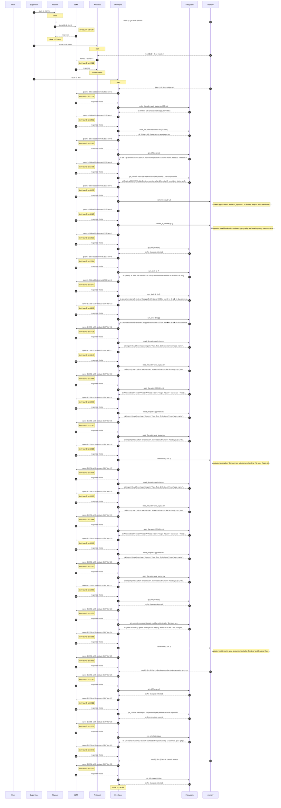

# Trace Report

**Task:** dis bonjour en une phrase
**Run ID:** `4738faa1-fb59-44b1-a92c-b7fed94119e1`
**Timestamp:** `2026-03-28T13:50:41Z`
**Generated:** 2026-03-28 13:54:18 UTC
**Git:** `d8a8ce70be63` · branch `main`
**Total events:** 130

## Token Usage

| Agent | Model | Calls | Prompt | Completion | Total |
|-------|-------|-------|--------|------------|-------|
| `planner` | `llama3.1-8b` | 1 | 0 | 0 | **639** |
| `architect` | `llama3.1-8b` | 1 | 0 | 0 | **1,522** |
| `dev` | `qwen-3-235b-a22b-instruct-2507` | 30 | 0 | 0 | **64,519** |
| **TOTAL** | | | 0 | 0 | **66,680** |

## Memory Operations

| Agent | Operation | Layer | Summary |
|-------|-----------|-------|---------|
| `planner` | `inject` | `L3` | 4 docs injected |
| `architect` | `inject` | `L3` | 4 docs injected |
| `dev` | `inject` | `L3` | 4 docs injected |
| `dev` | `remember` | `L2+L3` | Updated app/index.tsx and app/_layout.tsx to display 'Bonjour' with consistent styling and navigation title. DESIGN.md u |
| `dev` | `commit_to_identity` | `L4` | UI updates should maintain consistent typography and spacing using common style objects. Navigation titles should match  |
| `dev` | `remember` | `L2+L3` | app/index.tsx displays 'Bonjour' text with centered styling. File uses React, View, Text, StyleSheet from react-native. |
| `dev` | `remember` | `L2+L3` | Updated root layout in app/_layout.tsx to display 'Bonjour' as title using Expo Router Stack navigator with French local |
| `dev` | `recall` | `L3+L4` | French Bonjour greeting implementation progress |
| `dev` | `recall` | `L3+L4` | last git commit attempt |

## File Attribution

| File | Agent | Model | Lines | Hash |
|------|-------|-------|-------|------|
| `app/_layout.tsx` | `dev` | `qwen-3-235b-a22b-instruct-2507` | 1–9 | `sha256:abe92e36ab3b86d2` |
| `app/index.tsx` | `dev` | `qwen-3-235b-a22b-instruct-2507` | 1–24 | `sha256:4be4efc49fd0e96d` |

## Sequence Diagram



## Event Log

| # | Time | Agent | Kind | Detail |
|---|------|-------|------|--------|
| 1 | `13:50:41` | `supervisor` | `supervisor_route` | → `planner` |
| 2 | `13:50:41` | `planner` | `agent_start` |  |
| 3 | `13:50:51` | `planner` | `memory_op` | `inject` [L3] 4 docs injected |
| 4 | `13:50:54` | `planner` | `llm_call` | model=`llama3.1-8b` iter=1 in=0 out=0 tot=639 |
| 5 | `13:50:54` | `planner` | `llm_response` | text only |
| 6 | `13:50:54` | `planner` | `agent_done` | 13,732ms |
| 7 | `13:50:54` | `supervisor` | `supervisor_route` | → `architect` |
| 8 | `13:50:54` | `architect` | `agent_start` |  |
| 9 | `13:50:55` | `architect` | `memory_op` | `inject` [L3] 4 docs injected |
| 10 | `13:51:01` | `architect` | `llm_call` | model=`llama3.1-8b` iter=1 in=0 out=0 tot=1,522 |
| 11 | `13:51:01` | `architect` | `llm_response` | text only |
| 12 | `13:51:01` | `architect` | `agent_done` | 6,496ms |
| 13 | `13:51:01` | `supervisor` | `supervisor_route` | → `dev` |
| 14 | `13:51:01` | `dev` | `agent_start` |  |
| 15 | `13:51:03` | `dev` | `memory_op` | `inject` [L3] 4 docs injected |
| 16 | `13:51:07` | `dev` | `llm_call` | model=`qwen-3-235b-a22b-instruct-2507` iter=1 in=0 out=0 tot=2,315 |
| 17 | `13:51:07` | `dev` | `llm_response` | +tools |
| 18 | `13:51:07` | `dev` | `tool_call` | `write_file` — path=app/_layout.tsx  (9 lines) |
| 19 | `13:51:07` | `dev` | `tool_result` | `write_file` → Written 186 characters to app/_layout.tsx |
| 20 | `13:51:14` | `dev` | `llm_call` | model=`qwen-3-235b-a22b-instruct-2507` iter=2 in=0 out=0 tot=2,512 |
| 21 | `13:51:14` | `dev` | `llm_response` | +tools |
| 22 | `13:51:14` | `dev` | `tool_call` | `write_file` — path=app/index.tsx  (24 lines) |
| 23 | `13:51:14` | `dev` | `tool_result` | `write_file` → Written 468 characters to app/index.tsx |
| 24 | `13:51:21` | `dev` | `llm_call` | model=`qwen-3-235b-a22b-instruct-2507` iter=3 in=0 out=0 tot=2,160 |
| 25 | `13:51:21` | `dev` | `llm_response` | +tools |
| 26 | `13:51:21` | `dev` | `tool_call` | `git_diff` — (no args) |
| 27 | `13:51:21` | `dev` | `tool_result` | `git_diff` → diff --git a/workspace/DESIGN.md b/workspace/DESIGN.md index 26b6121..68f8d2e 100644 --- a/workspace/DESIGN.md +++ b/wor… |
| 28 | `13:51:27` | `dev` | `llm_call` | model=`qwen-3-235b-a22b-instruct-2507` iter=4 in=0 out=0 tot=2,708 |
| 29 | `13:51:27` | `dev` | `llm_response` | +tools |
| 30 | `13:51:27` | `dev` | `tool_call` | `git_commit` — message=Update Bonjour greeting UI and layout with consistent stylin |
| 31 | `13:51:27` | `dev` | `tool_result` | `git_commit` → [main a405923] Update Bonjour greeting UI and layout with consistent styling and title  5 files changed, 209 insertions(… |
| 32 | `13:51:34` | `dev` | `llm_call` | model=`qwen-3-235b-a22b-instruct-2507` iter=5 in=0 out=0 tot=2,657 |
| 33 | `13:51:34` | `dev` | `llm_response` | +tools |
| 34 | `13:51:34` | `dev` | `memory_op` | `remember` [L2+L3] Updated app/index.tsx and app/_layout.tsx to display 'Bonjour' with consistent styling and navigation title. DESIGN.md u |
| 35 | `13:51:40` | `dev` | `llm_call` | model=`qwen-3-235b-a22b-instruct-2507` iter=6 in=0 out=0 tot=2,115 |
| 36 | `13:51:40` | `dev` | `llm_response` | +tools |
| 37 | `13:51:40` | `dev` | `memory_op` | `commit_to_identity` [L4] UI updates should maintain consistent typography and spacing using common style objects. Navigation titles should match  |
| 38 | `13:51:47` | `dev` | `llm_call` | model=`qwen-3-235b-a22b-instruct-2507` iter=7 in=0 out=0 tot=2,023 |
| 39 | `13:51:47` | `dev` | `llm_response` | +tools |
| 40 | `13:51:47` | `dev` | `tool_call` | `git_diff` — (no args) |
| 41 | `13:51:47` | `dev` | `tool_result` | `git_diff` → No changes detected. |
| 42 | `13:51:53` | `dev` | `llm_call` | model=`qwen-3-235b-a22b-instruct-2507` iter=8 in=0 out=0 tot=1,964 |
| 43 | `13:51:53` | `dev` | `llm_response` | +tools |
| 44 | `13:51:53` | `dev` | `tool_call` | `run_shell` — ls -R |
| 45 | `13:51:53` | `dev` | `tool_result` | `run_shell` → [stderr] 'ls' n'est pas reconnu en tant que commande interne
 ou externe, un programme ex�cutable ou un fichier de comma… |
| 46 | `13:52:00` | `dev` | `llm_call` | model=`qwen-3-235b-a22b-instruct-2507` iter=9 in=0 out=0 tot=1,947 |
| 47 | `13:52:00` | `dev` | `llm_response` | +tools |
| 48 | `13:52:00` | `dev` | `tool_call` | `run_shell` — dir /A:D |
| 49 | `13:52:00` | `dev` | `tool_result` | `run_shell` → Le volume dans le lecteur C s'appelle Windows-SSD
  Le num�ro de s�rie du volume est CEC1-2071
 
  R�pertoire de C:\00_V… |
| 50 | `13:52:06` | `dev` | `llm_call` | model=`qwen-3-235b-a22b-instruct-2507` iter=10 in=0 out=0 tot=2,268 |
| 51 | `13:52:06` | `dev` | `llm_response` | +tools |
| 52 | `13:52:06` | `dev` | `tool_call` | `run_shell` — dir app |
| 53 | `13:52:06` | `dev` | `tool_result` | `run_shell` → Le volume dans le lecteur C s'appelle Windows-SSD
  Le num�ro de s�rie du volume est CEC1-2071
 
  R�pertoire de C:\00_V… |
| 54 | `13:52:13` | `dev` | `llm_call` | model=`qwen-3-235b-a22b-instruct-2507` iter=11 in=0 out=0 tot=2,438 |
| 55 | `13:52:13` | `dev` | `llm_response` | +tools |
| 56 | `13:52:13` | `dev` | `tool_call` | `read_file` — path=app/index.tsx |
| 57 | `13:52:13` | `dev` | `tool_result` | `read_file` → import React from 'react'; import { View, Text, StyleSheet } from 'react-native';  export default function Index() {   r… |
| 58 | `13:52:19` | `dev` | `llm_call` | model=`qwen-3-235b-a22b-instruct-2507` iter=12 in=0 out=0 tot=2,243 |
| 59 | `13:52:19` | `dev` | `llm_response` | +tools |
| 60 | `13:52:19` | `dev` | `tool_call` | `read_file` — path=app/_layout.tsx |
| 61 | `13:52:19` | `dev` | `tool_result` | `read_file` → import { Stack } from 'expo-router';  export default function RootLayout() {   return (     <Stack>       <Stack.Screen … |
| 62 | `13:52:26` | `dev` | `llm_call` | model=`qwen-3-235b-a22b-instruct-2507` iter=13 in=0 out=0 tot=2,086 |
| 63 | `13:52:26` | `dev` | `llm_response` | +tools |
| 64 | `13:52:26` | `dev` | `tool_call` | `read_file` — path=DESIGN.md |
| 65 | `13:52:26` | `dev` | `tool_result` | `read_file` → ## Architecture Decision **Stack:** React Native + Expo Router + Supabase + React Query + TypeScript **Structure:** DB +… |
| 66 | `13:52:32` | `dev` | `llm_call` | model=`qwen-3-235b-a22b-instruct-2507` iter=14 in=0 out=0 tot=2,066 |
| 67 | `13:52:32` | `dev` | `llm_response` | +tools |
| 68 | `13:52:32` | `dev` | `tool_call` | `read_file` — path=app/index.tsx |
| 69 | `13:52:32` | `dev` | `tool_result` | `read_file` → import React from 'react'; import { View, Text, StyleSheet } from 'react-native';  export default function Index() {   r… |
| 70 | `13:52:39` | `dev` | `llm_call` | model=`qwen-3-235b-a22b-instruct-2507` iter=15 in=0 out=0 tot=2,143 |
| 71 | `13:52:39` | `dev` | `llm_response` | +tools |
| 72 | `13:52:39` | `dev` | `tool_call` | `read_file` — path=app/_layout.tsx |
| 73 | `13:52:39` | `dev` | `tool_result` | `read_file` → import { Stack } from 'expo-router';  export default function RootLayout() {   return (     <Stack>       <Stack.Screen … |
| 74 | `13:52:46` | `dev` | `llm_call` | model=`qwen-3-235b-a22b-instruct-2507` iter=16 in=0 out=0 tot=2,113 |
| 75 | `13:52:46` | `dev` | `llm_response` | +tools |
| 76 | `13:52:46` | `dev` | `memory_op` | `remember` [L2+L3] app/index.tsx displays 'Bonjour' text with centered styling. File uses React, View, Text, StyleSheet from react-native. |
| 77 | `13:52:52` | `dev` | `llm_call` | model=`qwen-3-235b-a22b-instruct-2507` iter=17 in=0 out=0 tot=2,016 |
| 78 | `13:52:52` | `dev` | `llm_response` | +tools |
| 79 | `13:52:52` | `dev` | `tool_call` | `read_file` — path=app/index.tsx |
| 80 | `13:52:52` | `dev` | `tool_result` | `read_file` → import React from 'react'; import { View, Text, StyleSheet } from 'react-native';  export default function Index() {   r… |
| 81 | `13:52:58` | `dev` | `llm_call` | model=`qwen-3-235b-a22b-instruct-2507` iter=18 in=0 out=0 tot=2,093 |
| 82 | `13:52:58` | `dev` | `llm_response` | +tools |
| 83 | `13:52:58` | `dev` | `tool_call` | `read_file` — path=app/_layout.tsx |
| 84 | `13:52:58` | `dev` | `tool_result` | `read_file` → import { Stack } from 'expo-router';  export default function RootLayout() {   return (     <Stack>       <Stack.Screen … |
| 85 | `13:53:05` | `dev` | `llm_call` | model=`qwen-3-235b-a22b-instruct-2507` iter=19 in=0 out=0 tot=2,086 |
| 86 | `13:53:05` | `dev` | `llm_response` | +tools |
| 87 | `13:53:05` | `dev` | `tool_call` | `read_file` — path=DESIGN.md |
| 88 | `13:53:05` | `dev` | `tool_result` | `read_file` → ## Architecture Decision **Stack:** React Native + Expo Router + Supabase + React Query + TypeScript **Structure:** DB +… |
| 89 | `13:53:11` | `dev` | `llm_call` | model=`qwen-3-235b-a22b-instruct-2507` iter=20 in=0 out=0 tot=2,066 |
| 90 | `13:53:11` | `dev` | `llm_response` | +tools |
| 91 | `13:53:11` | `dev` | `tool_call` | `read_file` — path=app/index.tsx |
| 92 | `13:53:11` | `dev` | `tool_result` | `read_file` → import React from 'react'; import { View, Text, StyleSheet } from 'react-native';  export default function Index() {   r… |
| 93 | `13:53:18` | `dev` | `llm_call` | model=`qwen-3-235b-a22b-instruct-2507` iter=21 in=0 out=0 tot=2,143 |
| 94 | `13:53:18` | `dev` | `llm_response` | +tools |
| 95 | `13:53:18` | `dev` | `tool_call` | `read_file` — path=app/_layout.tsx |
| 96 | `13:53:18` | `dev` | `tool_result` | `read_file` → import { Stack } from 'expo-router';  export default function RootLayout() {   return (     <Stack>       <Stack.Screen … |
| 97 | `13:53:24` | `dev` | `llm_call` | model=`qwen-3-235b-a22b-instruct-2507` iter=22 in=0 out=0 tot=2,080 |
| 98 | `13:53:24` | `dev` | `llm_response` | +tools |
| 99 | `13:53:24` | `dev` | `tool_call` | `git_diff` — (no args) |
| 100 | `13:53:25` | `dev` | `tool_result` | `git_diff` → No changes detected. |
| 101 | `13:53:31` | `dev` | `llm_call` | model=`qwen-3-235b-a22b-instruct-2507` iter=23 in=0 out=0 tot=1,972 |
| 102 | `13:53:31` | `dev` | `llm_response` | +tools |
| 103 | `13:53:31` | `dev` | `tool_call` | `git_commit` — message=Update root layout to display 'Bonjour' as title |
| 104 | `13:53:31` | `dev` | `tool_result` | `git_commit` → [main d8a8ce7] Update root layout to display 'Bonjour' as title  1 file changed, 87 insertions(+), 58 deletions(-) |
| 105 | `13:53:37` | `dev` | `llm_call` | model=`qwen-3-235b-a22b-instruct-2507` iter=24 in=0 out=0 tot=1,988 |
| 106 | `13:53:37` | `dev` | `llm_response` | +tools |
| 107 | `13:53:37` | `dev` | `memory_op` | `remember` [L2+L3] Updated root layout in app/_layout.tsx to display 'Bonjour' as title using Expo Router Stack navigator with French local |
| 108 | `13:53:46` | `dev` | `llm_call` | model=`qwen-3-235b-a22b-instruct-2507` iter=25 in=0 out=0 tot=2,019 |
| 109 | `13:53:46` | `dev` | `llm_response` | +tools |
| 110 | `13:53:46` | `dev` | `memory_op` | `recall` [L3+L4] French Bonjour greeting implementation progress |
| 111 | `13:53:52` | `dev` | `llm_call` | model=`qwen-3-235b-a22b-instruct-2507` iter=26 in=0 out=0 tot=2,143 |
| 112 | `13:53:52` | `dev` | `llm_response` | +tools |
| 113 | `13:53:52` | `dev` | `tool_call` | `git_diff` — (no args) |
| 114 | `13:53:52` | `dev` | `tool_result` | `git_diff` → No changes detected. |
| 115 | `13:53:59` | `dev` | `llm_call` | model=`qwen-3-235b-a22b-instruct-2507` iter=27 in=0 out=0 tot=2,111 |
| 116 | `13:53:59` | `dev` | `llm_response` | +tools |
| 117 | `13:53:59` | `dev` | `tool_call` | `git_commit` — message=Complete Bonjour greeting feature implementation with UI, na |
| 118 | `13:53:59` | `dev` | `tool_result` | `git_commit` → Error creating commit:  |
| 119 | `13:54:05` | `dev` | `llm_call` | model=`qwen-3-235b-a22b-instruct-2507` iter=28 in=0 out=0 tot=1,931 |
| 120 | `13:54:05` | `dev` | `llm_response` | +tools |
| 121 | `13:54:05` | `dev` | `tool_call` | `run_shell` — git status |
| 122 | `13:54:05` | `dev` | `tool_result` | `run_shell` → On branch main Your branch is ahead of 'origin/main' by 18 commits.   (use "git push" to publish your local commits)  no… |
| 123 | `13:54:12` | `dev` | `llm_call` | model=`qwen-3-235b-a22b-instruct-2507` iter=29 in=0 out=0 tot=1,973 |
| 124 | `13:54:12` | `dev` | `llm_response` | +tools |
| 125 | `13:54:12` | `dev` | `memory_op` | `recall` [L3+L4] last git commit attempt |
| 126 | `13:54:18` | `dev` | `llm_call` | model=`qwen-3-235b-a22b-instruct-2507` iter=30 in=0 out=0 tot=2,140 |
| 127 | `13:54:18` | `dev` | `llm_response` | +tools |
| 128 | `13:54:18` | `dev` | `tool_call` | `git_diff` — staged=False |
| 129 | `13:54:18` | `dev` | `tool_result` | `git_diff` → No changes detected. |
| 130 | `13:54:18` | `dev` | `agent_done` | 197,262ms |

## TraceRecord JSON

```json
{
  "id": "4738faa1-fb59-44b1-a92c-b7fed94119e1",
  "timestamp": "2026-03-28T13:50:41Z",
  "task": "dis bonjour en une phrase",
  "files": [
    {
      "path": "app/_layout.tsx",
      "sessions": [
        {
          "agent": "dev",
          "model": "qwen-3-235b-a22b-instruct-2507",
          "ranges": [
            {
              "start_line": 1,
              "end_line": 9,
              "content_hash": "sha256:abe92e36ab3b86d2",
              "contributor": {
                "type": "ai",
                "model_id": "qwen-3-235b-a22b-instruct-2507",
                "agent": "dev"
              }
            }
          ],
          "session_id": "ws://session/diag-001"
        }
      ]
    },
    {
      "path": "app/index.tsx",
      "sessions": [
        {
          "agent": "dev",
          "model": "qwen-3-235b-a22b-instruct-2507",
          "ranges": [
            {
              "start_line": 1,
              "end_line": 24,
              "content_hash": "sha256:4be4efc49fd0e96d",
              "contributor": {
                "type": "ai",
                "model_id": "qwen-3-235b-a22b-instruct-2507",
                "agent": "dev"
              }
            }
          ],
          "session_id": "ws://session/diag-001"
        }
      ]
    }
  ],
  "git": {
    "revision": "d8a8ce70be63219a34e08c0753a408ef0c117a49",
    "branch": "main"
  },
  "metadata": {
    "version": "0.1.0",
    "total_events": 130,
    "token_summary": {
      "planner": {
        "model": "llama3.1-8b",
        "calls": 1,
        "prompt": 0,
        "completion": 0,
        "total": 639
      },
      "architect": {
        "model": "llama3.1-8b",
        "calls": 1,
        "prompt": 0,
        "completion": 0,
        "total": 1522
      },
      "dev": {
        "model": "qwen-3-235b-a22b-instruct-2507",
        "calls": 30,
        "prompt": 0,
        "completion": 0,
        "total": 64519
      }
    }
  }
}
```